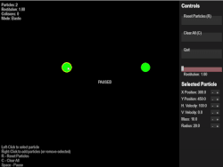

# 🎯 2D Particle Collision Simulator 💥

[](https://www.python.org/)
[](https://opensource.org/licenses/MIT)

A sophisticated 2D physics simulator that models elastic and inelastic collisions between multiple particles with real-time visualization. Perfect for demonstrating fundamental physics principles and computational physics implementations.

**Elastic Collision:**



**Totally Inelastic Collision of 3 Particles at an Angle:**


## ✨ Features

- **Dual Collision Models**  
  👉 Full support for both perfectly elastic and inelastic collisions
- **Multi-Particle System**  
  👉 Simulate any number of particles with customizable properties
- **Real-time Visualization**  
  👉 Built with Pygame for smooth graphical representation
- **Physics-Accurate**  
  👉 Implements conservation of momentum and kinetic energy principles
- **Customizable Parameters**  
  👉 Adjust mass, velocity, restitution coefficients, and more
- **Optimized Performance**  
  👉 Efficient collision detection algorithms for smooth operation

## Installation ⚙️
1. Clone the repository
```bash
git clone https://github.com/SulkBash/Collision-Simulator.git
cd Collision-Simulator
```
2. Install dependencies
```bash
cd Collision_Sim
pip install -r requirements.txt
```
3. Run the simulation
```bash
python collision.py
```
## 🔬 Technical Implementation

### Physics Foundations
The force is only applied perpendicular to the plane of collision, so the tangential velocity remains unchanged (no force = no acceleration)
#### 1. Conservation of Momentum and Impulse
```math
m_1\vec{v}_1 + m_2\vec{v}_2 = m_1\vec{v}_1' + m_2\vec{v}_2'
```
The unit vector in the normal direction of the collision is:
```math
\hat{n} = \dfrac{\vec{r_2}-\vec{r_1}}{||\vec{r_2}-\vec{r_1}||}
```
Where r1 and r2 are the position vectors of each particle. Then, by the Impulse-Momentum theorem:
```math
J = J_1 = - J_2 = \lambda \hat{n}
```
```math
\Rightarrow \vec{p'_1} - \vec{p_1} = J_1 = \lambda \hat{n}
```
```math
\vec{p'_2} - \vec{p_2} = J_2 = -\lambda \hat{n}
```

#### 2. Coefficient of Restitution
```math
e = \dfrac{v'_{1n}-v'_{2n}}{v_{1n}-v_{2n}}
```

Combining all these equations one can solve for the:

### 3. Equations of Final Velocities
```math
\vec{v'_1} = \vec{v_1} + \dfrac{m_2}{m_1+m_2}(e+1)((\vec{v_2}-\vec{v_1})\cdot \hat{n})\hat{n}
```

```math
\vec{v'_2} = \vec{v_2} - \dfrac{m_1}{m_1+m_2}(e+1)((\vec{v_2}-\vec{v_1})\cdot \hat{n})\hat{n}
```
Please observe that when e = 1 (elastic collision), you arrive at the well known equations for the final velocites after an elastic collision

## Dependencies 📦

- **Python 3.8+**
- **Pygame**
- **NumPy**

## Contributions are Welcome! 🤝
1. Fork the Repository
2. Create your feature branch (git checkout -b feature/amazing-feature)
3. Commit your changes (git commit -m 'Add some amazing feature')
4. Push to the branch (git push origin feature/amazing-feature)
5. Open a Pull Request

## 📜 License

Distributed under the MIT License. See  for more information.
